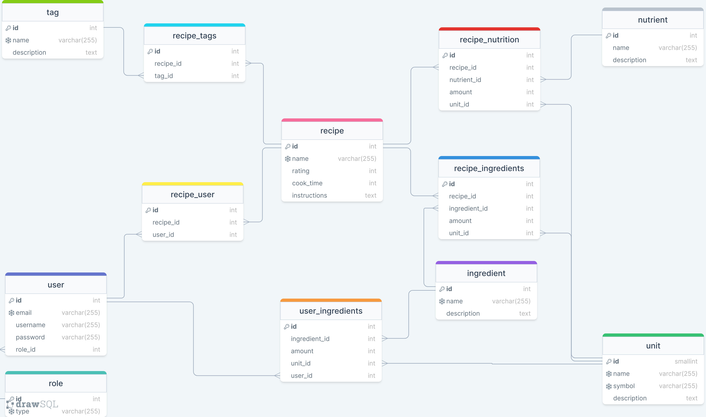

# Recipe-Finder
It's always a hassle trying to decide what you want to make for dinner, especially after a long day of work... So why not have an app decide for you?

## Data
The data gathered and processed can be represented as an ERD shown below:

From the diagram, you can see that information about:
- recipes: their nutrition, ingredients, tags and which user it belongs to.
- users: their role and their list of ingredients.

Some things to note:
- the `rating` of the recipe is recorded as an integer. For example, a rating of 4.6/5 is recorded as 460 (4.6 * 100).
- the `amount` in certain tables are also recorded as integers.